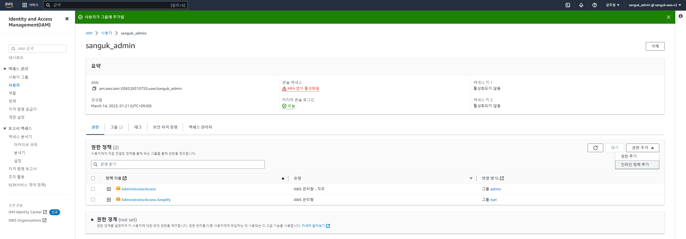
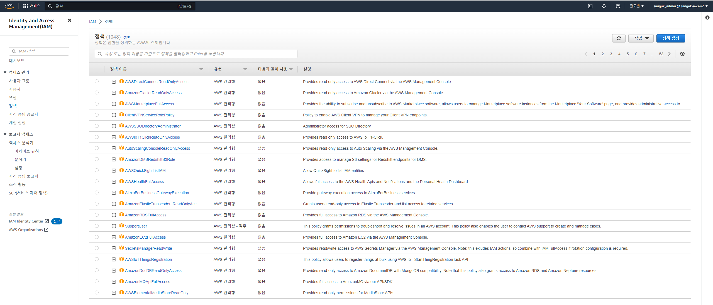

## IAM
### 1. IAM
1. IAM = Identity and Access Management, Global service
→ `IAM`은 리전 선택이 필요하지 않은 글로벌 서비스이다. 

### 2. IAM: Users & Groups
1. Root account created by default, shouldn’t be used or shared
→ 기본으로 생성되는 루트 계정은 계정에 대한 모든 권한을 가지고 있기 때문에 위험하다.
그렇기에 이 루트 계정은 오직 계정을 생성할 때에만 사용해야 한다. 그 후에는 루트 계정을 더 이상 사용해서도, 공유해서도 안 된다.

2. Users are people within your organization, and can be grouped
→ 하나의 유저는 조직 내 한 사람에 해당된다. 필요하다면 유저들을 그룹으로 묶을 수 있다.

3. Groups only contain users, not other groups
→ 그룹에는 오직 유저만 배치할 수 있다. 서브 그룹의 설정이 불가능하다.

4. Users don’t have to belong to a group, and user can belong to multiple groups
→ 그룹에 포함되지 않는 유저를 생성할 수 있다. 단, 이는 별로 추천하지 않는다. 이와 반대로 한 사용자를 여러 그룹에 포함시킬 수도 있다.

출처 → [AWS Certified Solutions Architect Slides v10](https://courses.datacumulus.com/downloads/certified-solutions-architect-pn9/)

### 3. IAM: Permissions
`User`와 `Group`을 생성하는 이유는 다른 인원들이 허가받은 범위 내의 `AWS` 서비스를 이용할 수 있도록 허용하기 위해서이다.
그리고 허용을 위해서는 이들에게 권한을 부여해야 한다.

1. Users or Groups can be assigned JSON documents called policies. These policies define the permissions of the users
→ 이를 위해 유저 또는 그룹에게 `Policies`, 또는 `IAM Policies`라고 불리는 `JSON` 타입의 문서를 사용한다.
이 파일은 프로그래머가 아니더라도 이해할 수 있도록 이해하기 쉬운 영어로 구성되어 있다.

2. In AWS you apply the `Least privilege principle`: don’t give more permissions than a user needs
→ `AWS`는 최소 권한의 원칙을 적용한다. 유저가 꼭 필요한 것 이상의 권한을 주지 않는 것이다.
유저가 허가받지 않은 서비스를 사용할 수 있도록 허용한다면, 새로운 유저가 너무 많은 서비스를 실행하여 큰 비용이 발생하거나 보안 문제를 야기할 수 있기 때문이다.

#### 1. Policies
해당 내용은 `EC2 Describe`, `Elastic Load Balancing Describe`, `CloudWatch Describe`를 허용한다.

~~~ JSON
{
    "Version": "2012-10-17",
    "Statement": [
        {
            "Effect": "Allow",
            "Action": "ec2:Describe*",
            "Resource": "*"
        },
        {
            "Effect": "Allow",
            "Action": "elasticloadbalancing:Describe*",
            "Resource": "*"
        },
        {
            "Effect": "Allow",
            "Action": [
                "cloudwatch:ListMetrics",
                "cloudwatch:GetMetricStatistics",
                "cloudwatch:Describe*"
            ],
            "Resource": "*"
        }
    ]
}
~~~

#### 2. IAM Policies inheritance

###### 1. Inline policy
유저 개개인에게 권한을 적용하기 위해 사용되는 정책을 `Inline Policy`라고 한다. 유저가 그룹에 속해있던 속해있지 않던 이 `Inline Policy`는 적용이 가능하다.

###### 2. IAM Policy Structure
정책의 구조와 정책 명명법에 대해서는 잘 익혀둬야 한다. `AWS`에서 자주보게 되는 형식이기 때문이다. `JSON` 형식으로 이루어져 있다.

1. `Version` : policy language version, always include "2012-10-17"
→ 정책 언어의 버전을 표현하기 위해 사용한다. 보통은 `2012-10-17`이다.

2. `Id` : an identifier for the policy (optional)
→ 정책을 식별하기 위한 식별자로 사용한다. 선택 사항이다.

3. `Statement` : one or more individual statements (required)
→ `Statement, 이하 문장`는 하나일 수도 있고, 여러개일 수도 있다. 이 문장에는 아주 중요한 부분들이 있다.

- `Sid` : an identifier for the statement (optional)
→ 문장 ID, 문장의 식별자로 사용한다.

- `Effect` : whether the statement allows or denies access (Allow, Deny)
→ 문장이 특정 `API`에 접근하는 것을 허용할 것인지, 거부할 것인지 선언할 때 사용한다.

- `Principle` : account/user/role to which this policy applied to
→ 특정 정책이 적용될 유저, 계정 또는 역할로 구성된다.

- `Action` : list of actions the policy allows or denies
→ `Effect`에 기반해 허용 및 거부되는 API 호출 목록이다.

- `Resource` : list of resources to witch the actions applied to
→ 적용될 `Action`의 리소스 목록이다.

- `Condition` : conditions for when this policy is in effect (optional)
→ `Statement`가 언제 적용될지를 결정한다.

### 4. Create Users and Groups
1. `Access management` -> `Users` -> `Add users` 버튼 클릭

2. `Set user details`
→ 유저명과 패스워드를 설정한다. 

3. `Set permission`
→ 권한을 설정한다. 유저를 그룹에 포함시킬 수 있다.

4. 이를 위해 그룹을 생성한다. 만약 그룹을 먼저 생성했다면 유저를 해당 그룹에 포함시킬 수 있다.

5. `Add tags(optional)`
→ `AWS`에서는 어디에서도 태그를 사용할 수 있는데, 유저의 접근을 추적, 제어할 수 있도록 도와주는 정보이다.
`Key`와 `Value`의 쌍으로 되어 있으며 `Department:Engineering`과 같은 형식으로 부서를 기입해 둔다거나 필요한 다른 정보를 기입하는 데 사용한다. 
6. 그룹, 계정 말고도 태그를 기입할 수 있는 곳은 많기 때문에 그냥 추가적인 정보를 기입하는 곳이라고 생각하면 된다.

7. `Download.csv` 다운로드
→ 유저의 자격 증명 정보가 들어있다. 타인을 위해 유저를 생성한 경우에는 특정 메일 주소로 유저 정보를 보낼 수 있다.
유저 생성 후 다운로드된 파일명은 `sanguk_admin_credentials`였다.

8. `Register account alias`
→ 대시보드에서 AWS 계정 별칭을 변경한다. 이후 유저 로그인을 위한 로그인 `URL`을 복사할 수 있다.

### 4. IAM User interface
1. `Users` → `Permissions` → `Permissions policies`
→ 권한을 부여할 수 있다.

2. `Policies`
→ `AWS`의 모든 정책이 있다. 권한의 상세 정보를 확인할 수 있으며, `Create policy` 버튼을 눌러 새로운 정책을 생성할 수 있다.

→ 관리자 계정 권한으로 설정한 `AdministratorAccess`는 모든 작업과 리소스가 허용된 상태임을 `JSON` 설정을 통해 확인할 수 있다.

---
#### ▶ Reference
- [Ultimate AWS Certified Solutions Architect Associate SAA-C03](https://www.udemy.com/course/aws-certified-solutions-architect-associate-saa-c03/)
---
