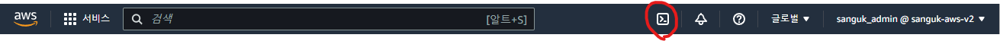
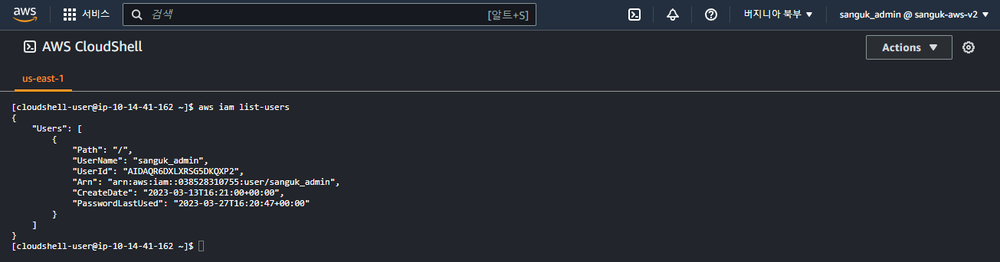

## CloudShell
- `Cloudshell`은 `AWS` 클라우드에서 무료로 사용 가능한 터미널과 같다. 자격 증명이 완료된 `CLI`에서 실행되는 것과 같은 결과를 취득할 수 있다.

- `Cloudshell`화면 우측 상단의 아이콘 클릭을 통해 접속이 가능하며,
- 사용 가능한 리전에 제한이 있는 서비스이므로 아이콘이 없다면 `Cloudshell availabilty region` → `AWS Cloudshell FAQs`에서 리전을 확인하자.

- `Configuration` → 글씨 크기, 테마, 안전하게 붙여넣기 등의 기능을 제공한다.
- 파일의 업로드, 다운로드가 가능하다.
- `Cloudshell`의 사용을 원치 않거나 선호하지 않을 경우 `AWS CLI`를 사용하면 되므로 문제는 없다.

~~~
$ aws iam list-users
~~~

---
#### ▶ Reference
- [Ultimate AWS Certified Solutions Architect Associate SAA-C03](https://www.udemy.com/course/aws-certified-solutions-architect-associate-saa-c03/)
---
